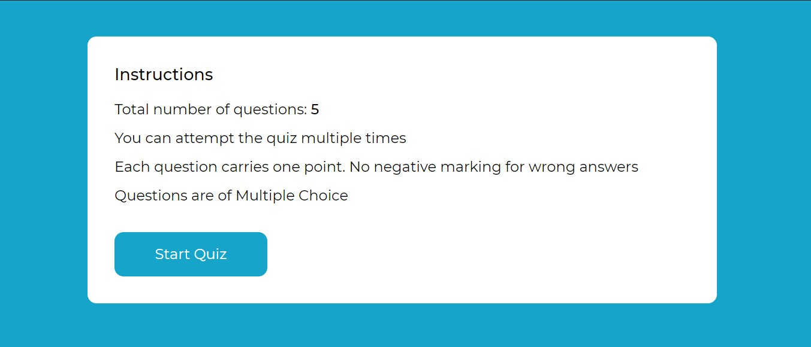
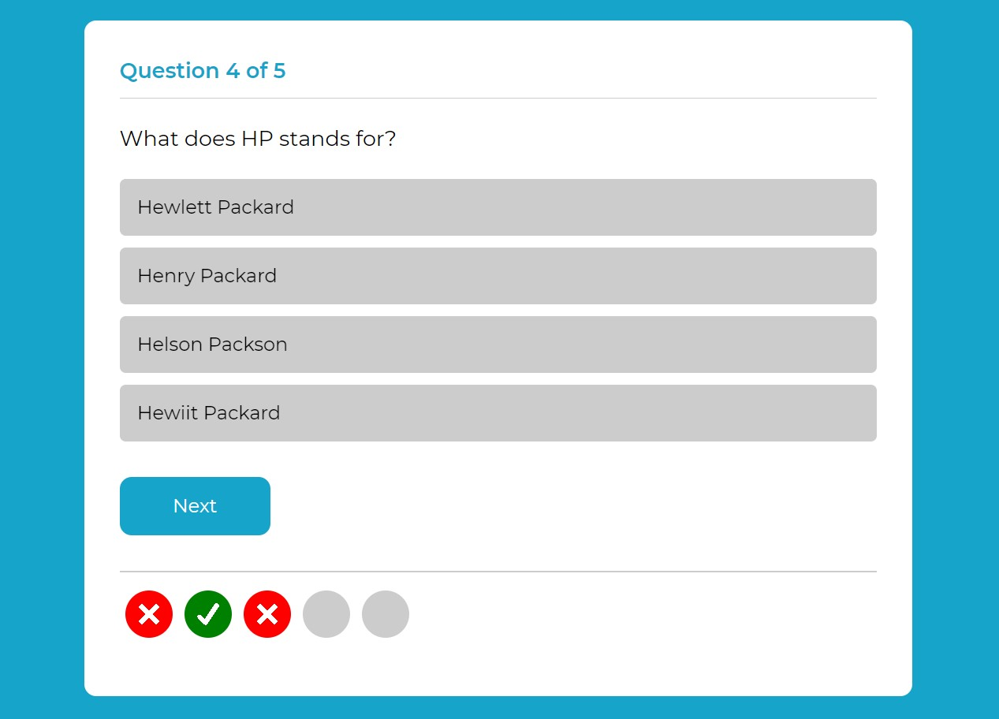
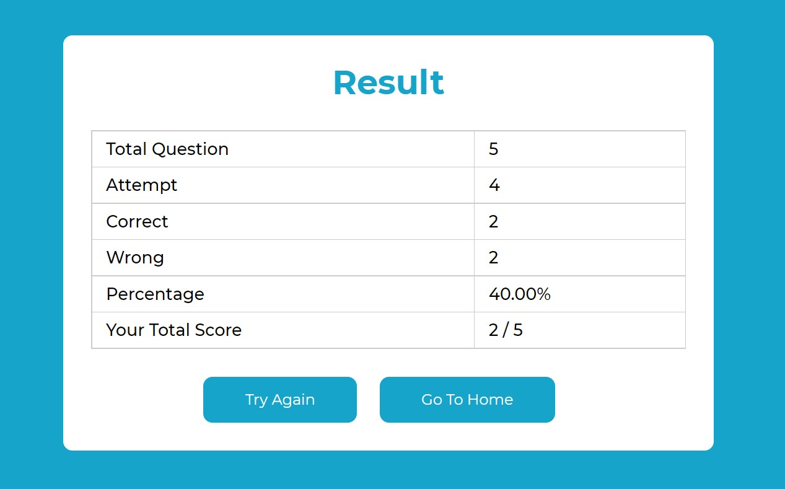

# 🎯 Quizziee - Générateur de Quiz Interactif

<div align="center">


**Une application de quiz moderne avec un design sombre épuré et des fonctionnalités avancées**

[🚀 Demo Live](#) • [📱 Screenshots](#screenshots) • [⚡ Fonctionnalités](#fonctionnalités) • [🛠️ Installation](#installation)

</div>

---

## ✨ Aperçu

Quizziee est une application web interactive de quiz avec un design moderne en thème sombre. Elle offre une expérience utilisateur fluide avec des animations élégantes, des statistiques détaillées et un mode d'apprentissage adaptatif.

### 🎨 Design Moderne
- **Thème sombre épuré** avec palette de couleurs professionnelle
- **Animations fluides** et transitions CSS avancées
- **Interface responsive** optimisée pour tous les appareils
- **Typographie moderne** avec la police Inter

## 📱 Screenshots

<div align="center">

### 🏠 Écran d'accueil


### 🎯 Interface de quiz


### 📊 Résultats détaillés


</div>

## ⚡ Fonctionnalités

### 🎮 Quiz Interactif
- ✅ **Questions à choix multiples** avec validation en temps réel
- ✅ **Mode apprentissage** - Les questions incorrectes sont reposées
- ✅ **Indicateurs visuels** pour les bonnes/mauvaises réponses
- ✅ **Progression en temps réel** avec barre d'avancement

### 📊 Statistiques Avancées
- 📈 **Analyse des performances** avec métriques détaillées
- 🔥 **Questions les plus échouées** avec taux d'erreur
- 💾 **Export des statistiques** au format JSON
- 🗑️ **Réinitialisation** des données avec confirmation

### 🎨 Interface Utilisateur
- 🌙 **Thème sombre moderne** avec accents colorés
- ✨ **Animations CSS avancées** et effets visuels
- 📱 **Design responsive** pour mobile, tablette et desktop
- 🎯 **UX optimisée** avec feedback visuel immédiat

### 🔧 Fonctionnalités Techniques
- ⚡ **Performance optimisée** avec animations GPU
- 🎨 **Variables CSS personnalisées** pour thématisation
- 📦 **Code modulaire** JavaScript organisé
- 🔒 **Stockage local** des données utilisateur

## 🛠️ Installation

### Prérequis
- Navigateur web moderne (Chrome, Firefox, Safari, Edge)
- Serveur web local (optionnel)

### 🚀 Démarrage rapide

1. **Clonez le repository**
   ```bash
   git clone https://github.com/Eren225/quiz_info_mana.git
   cd quiz_info_mana
   ```

2. **Ouvrez le projet**
   - Ouvrez `index.html` directement dans votre navigateur
   - Ou utilisez un serveur local :
   ```bash
   # Avec Python
   python -m http.server 8000
   
   # Avec Node.js
   npx serve .
   
   # Avec PHP
   php -S localhost:8000
   ```

3. **Accédez à l'application**
   ```
   http://localhost:8000
   ```

## 📁 Structure du Projet

```
quiz-generator/
├── 📄 index.html           # Page principale
├── 🎨 css/
│   └── style.css          # Styles avec thème sombre moderne
├── ⚡ js/
│   ├── app.js             # Logique principale de l'application
│   ├── question.js        # Gestion des questions
│   └── statistics.js      # Système de statistiques
├── 🖼️ img/
│   ├── logo.png           # Logo de l'application
│   ├── correct.png        # Icône réponse correcte
│   ├── wrong.png          # Icône réponse incorrecte
│   └── ...               # Autres ressources
├── 📱 screens/
│   ├── home-screen.jpg    # Screenshot accueil
│   ├── quiz-screen.jpg    # Screenshot quiz
│   └── result-screen.jpg  # Screenshot résultats
└── 📖 README.md           # Documentation
```

## 🎨 Palette de Couleurs

Le thème sombre utilise une palette de couleurs moderne et professionnelle :

```css
/* Couleurs principales */
--bg-primary: #0a0a0a      /* Arrière-plan principal */
--bg-secondary: #111111    /* Arrière-plan secondaire */
--bg-card: #1a1a1a        /* Cartes et conteneurs */

/* Couleurs d'accent */
--accent-primary: #6366f1  /* Violet principal */
--accent-secondary: #8b5cf6 /* Violet secondaire */
--accent-success: #10b981  /* Vert succès */
--accent-error: #ef4444    /* Rouge erreur */

/* Texte */
--text-primary: #ffffff    /* Texte principal */
--text-secondary: #b3b3b3  /* Texte secondaire */
--text-muted: #666666      /* Texte atténué */
```

## 🔧 Personnalisation

### Modifier les Questions
Éditez le fichier `js/question.js` pour ajouter vos propres questions :

```javascript
const questions = [
    {
        question: "Votre question ici ?",
        options: ["Option A", "Option B", "Option C", "Option D"],
        answer: 0 // Index de la bonne réponse (0-3)
    },
    // Ajoutez plus de questions...
];
```

### Personnaliser le Thème
Modifiez les variables CSS dans `css/style.css` :

```css
:root {
    --accent-primary: #your-color;
    --bg-card: #your-background;
    /* Autres variables... */
}
```

---
